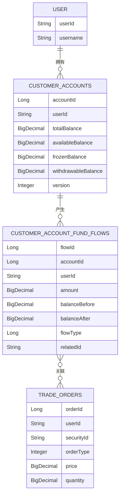
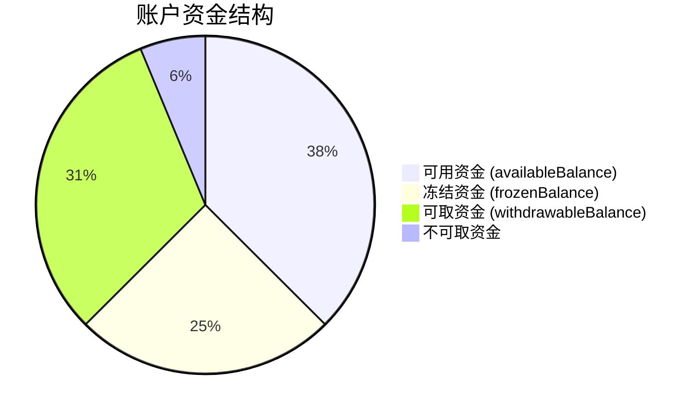
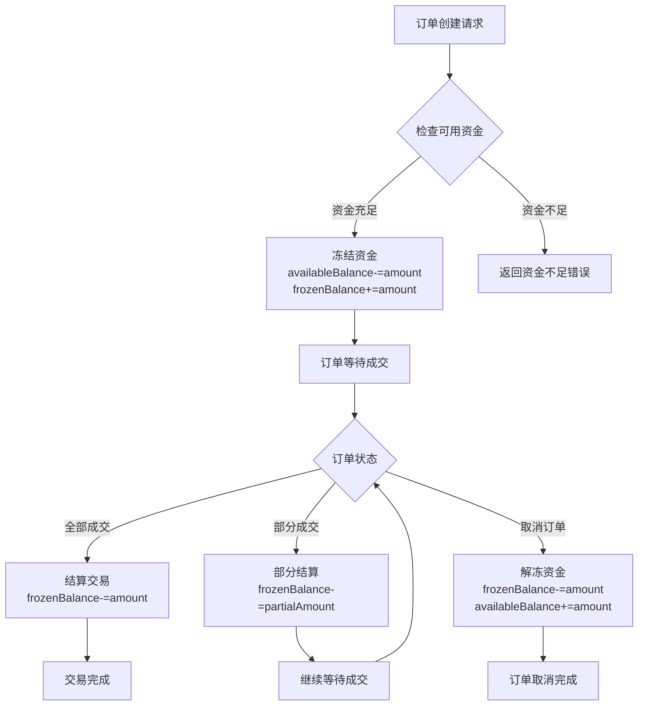
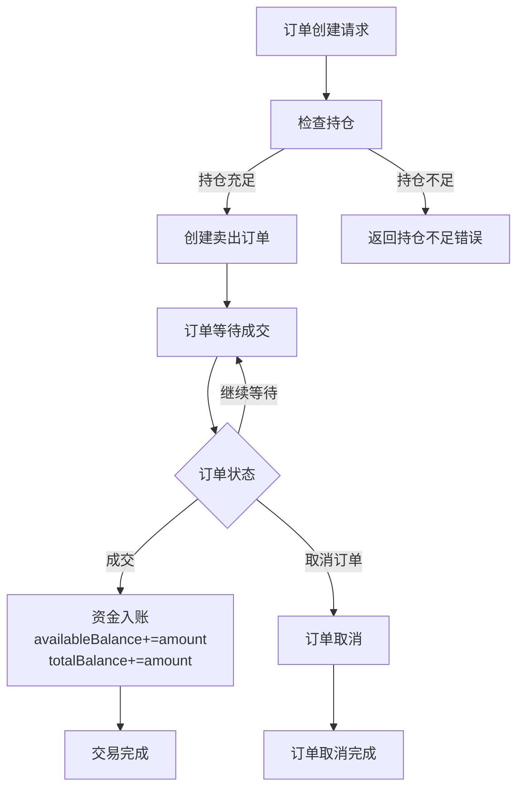
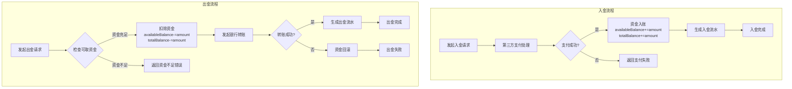
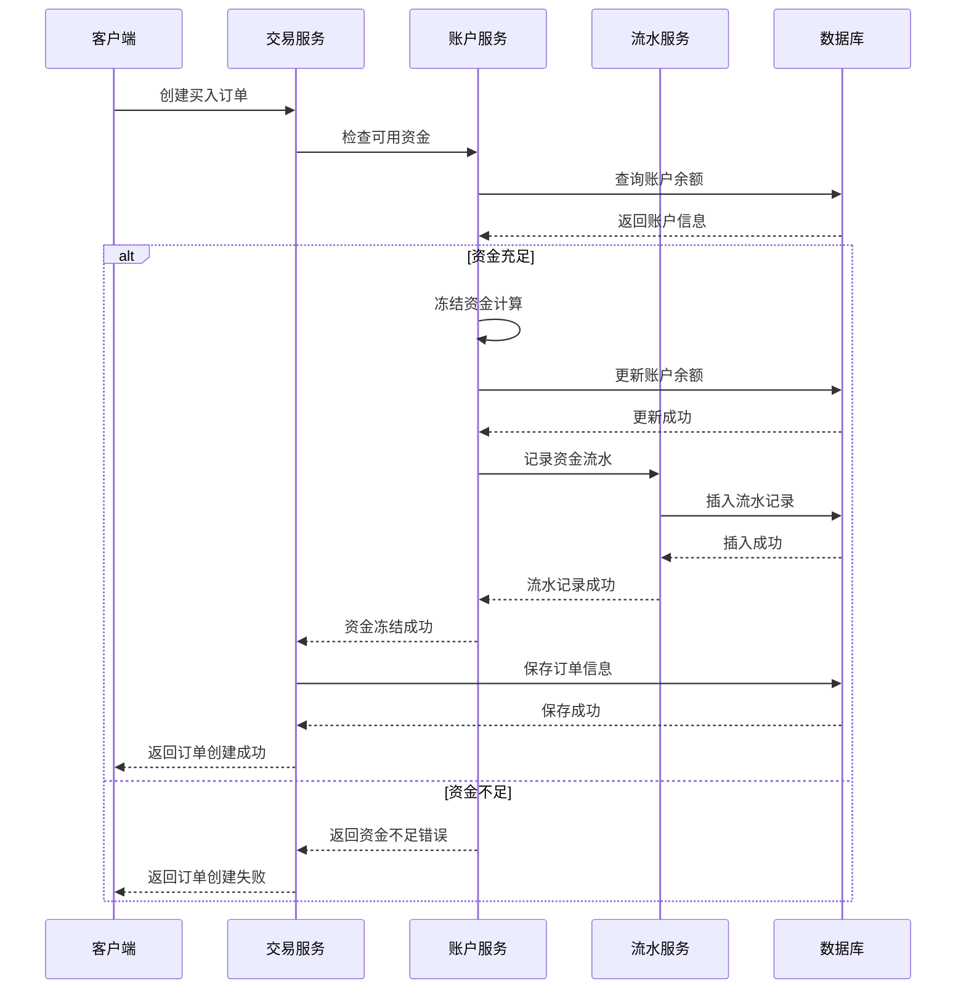

# 资金变化逻辑设计文档

## 1. 概述

本文档详细描述了星桥财富系统中资金变化的业务逻辑设计，包括账户资金模型、各类交易场景下的资金变动规则、资金流水记录以及相关的技术实现方案。本设计旨在确保系统资金数据的准确性、一致性和可追溯性。

## 2. 资金账户模型

### 2.1 核心实体

系统使用两个核心实体来管理用户资金：

1. **CustomerAccounts** - 客户资金账户表
   - 存储账户基本信息和当前资金状态
   - 关键字段：
     - `totalBalance` - 总资金
     - `availableBalance` - 可用资金
     - `frozenBalance` - 冻结资金
     - `withdrawableBalance` - 可取资金
     - `version` - 版本号（用于乐观锁控制）

2. **CustomerAccountFundFlows** - 账户资金流水表
   - 记录每笔资金变动的详细信息
   - 关键字段：
     - `accountId` - 关联资金账户ID
     - `userId` - 客户ID
     - `amount` - 变动金额（正：流入，负：流出）
     - `balanceBefore` - 变动前余额
     - `balanceAfter` - 变动后余额
     - `flowType` - 流水类型
     - `relatedId` - 关联业务ID

### 2.2 账户实体关系图



### 2.3 账户资金关系

账户各资金字段间的关系：

```
totalBalance = availableBalance + frozenBalance
withdrawableBalance ≤ availableBalance
```

以下是账户资金结构示意图：



## 3. 交易场景资金变化逻辑

### 3.1 买入订单

当用户提交买入订单时，系统需要执行以下资金操作：

1. **订单创建时**：
   - 计算订单总金额 = 价格 × 数量
   - 检查可用资金是否充足
   - 减少可用资金：`availableBalance -= orderAmount`
   - 增加冻结资金：`frozenBalance += orderAmount`
   - 生成资金流水记录（买入扣款类型）

2. **订单成交时**：
   - 减少冻结资金：`frozenBalance -= tradeAmount`
   - 生成交易成交的资金流水记录

3. **订单取消时**：
   - 减少冻结资金：`frozenBalance -= orderAmount`
   - 增加可用资金：`availableBalance += orderAmount`
   - 生成订单取消的资金流水记录

#### 3.1.1 买入订单资金流程图



### 3.2 卖出订单

当用户提交卖出订单时，系统需要执行以下资金操作：

1. **订单成交时**：
   - 计算成交金额 = 成交价格 × 成交数量
   - 增加可用资金：`availableBalance += tradeAmount`
   - 增加总资金：`totalBalance += tradeAmount`
   - 生成资金流水记录（卖出收款类型）

#### 3.2.1 卖出订单资金流程图



### 3.3 出入金操作

#### 3.3.1 入金
- 增加可用资金：`availableBalance += depositAmount`
- 增加总资金：`totalBalance += depositAmount`
- 生成入金流水记录

#### 3.3.2 出金
- 检查可取资金是否充足
- 减少可用资金：`availableBalance -= withdrawAmount`
- 减少总资金：`totalBalance -= withdrawAmount`
- 生成出金流水记录

#### 3.3.3 出入金资金流程图



### 3.4 费用收取

交易过程中可能产生的费用包括佣金、印花税等：

1. **费用收取时**：
   - 减少可用资金：`availableBalance -= feeAmount`
   - 减少总资金：`totalBalance -= feeAmount`
   - 生成费用流水记录

## 4. 技术实现方案

### 4.1 资金操作接口设计

在CustomerAccountsService中提供以下核心方法：

```java
/**
 * 冻结资金（买入订单时调用）
 * @param accountId 账户ID
 * @param amount 冻结金额
 * @return 操作结果
 */
boolean freezeFunds(Long accountId, BigDecimal amount);

/**
 * 解冻资金（订单取消时调用）
 * @param accountId 账户ID
 * @param amount 解冻金额
 * @return 操作结果
 */
boolean unfreezeFunds(Long accountId, BigDecimal amount);

/**
 * 扣除资金（订单成交时调用）
 * @param accountId 账户ID
 * @param amount 扣除金额
 * @return 操作结果
 */
boolean deductFunds(Long accountId, BigDecimal amount);

/**
 * 增加资金（卖出成交或入金时调用）
 * @param accountId 账户ID
 * @param amount 增加金额
 * @return 操作结果
 */
boolean addFunds(Long accountId, BigDecimal amount);
```

### 4.2 服务层调用流程图



### 4.3 事务控制

所有资金操作必须在事务中执行，确保数据一致性：

1. **使用Spring事务注解**：在资金操作方法上添加`@Transactional`注解
2. **乐观锁控制**：使用`version`字段防止并发更新问题
3. **分布式事务**：对于跨服务的资金操作，考虑使用Seata等分布式事务框架

### 4.4 乐观锁更新流程图

```mermaid
flowchart TD
    A[获取账户信息<br>包含version字段] --> B[执行业务逻辑<br>计算新的资金余额]
    B --> C[更新账户信息<br>带上version条件]
    C --> D{更新成功?}
    D -->|是| E[操作完成]
    D -->|否| F[发生并发更新]
    F --> G{重试次数是否超过限制?}
    G -->|否| A
    G -->|是| H[抛出乐观锁异常]

### 4.3 异常处理

1. **资金不足异常**：当可用资金不足时，抛出`InsufficientFundsException`
2. **账户状态异常**：当账户被冻结或状态异常时，抛出`AccountStatusException`
3. **并发更新异常**：捕获`OptimisticLockingFailureException`并进行重试或提示

### 4.4 资金流水记录

每笔资金变动都必须记录流水：

```java
/**
 * 记录资金流水
 * @param accountId 账户ID
 * @param userId 用户ID
 * @param amount 变动金额
 * @param balanceBefore 变动前余额
 * @param balanceAfter 变动后余额
 * @param flowType 流水类型
 * @param relatedId 关联业务ID
 * @param relatedType 关联业务类型
 */
void recordFundFlow(String accountId, String userId, BigDecimal amount, 
                    BigDecimal balanceBefore, BigDecimal balanceAfter, 
                    Long flowType, String relatedId, Long relatedType);
```

## 5. 安全性考虑

1. **权限控制**：确保只有授权用户才能执行资金操作
2. **数据验证**：对所有输入参数进行严格验证，防止恶意输入
3. **日志审计**：记录所有资金操作的详细日志，便于审计和问题排查
4. **限额控制**：实现交易限额和出金限额功能

## 6. 性能优化

1. **缓存策略**：对账户信息进行缓存，减少数据库查询压力
2. **批量处理**：对于大量资金流水记录，考虑批量插入
3. **异步处理**：非核心的资金流水记录可以考虑异步处理

## 7. 测试策略

1. **单元测试**：对每个资金操作方法进行单元测试
2. **集成测试**：测试完整的交易流程中的资金变化
3. **压力测试**：模拟高并发场景下的资金操作
4. **边界测试**：测试各种边界条件，如资金刚好足够、为零等情况

## 8. 未来扩展

1. **支持多币种**：扩展系统支持多种货币的资金管理
2. **利息计算**：添加账户资金利息计算功能
3. **资金预警**：实现资金阈值预警机制
4. **风控规则**：集成更复杂的风控规则系统

---

*本文档由星桥财富开发团队编制，最后更新时间：2025-09-23*